# 机器人本体详细对比

更新日期：2026-09-17

## 决策口径

当前核心任务是工厂线束布线、捋线、端子/连接器插接，同时兼顾 3C 打包、家电/台式机组装和精密件转移。评分维度及权重为：底盘移动 25%、工作空间 15%、力控柔顺 20%、精度 15%、接口开放 10%、工业成熟 15%。

“保持机身朝向纯横移”是轮式移动本体的硬门槛。双足本体理论上可以侧步，但侧步不等于低扰动、可重复、连续的工业蟹行，因此统一标记为待实测，不能直接视为通过。

## 型号图示

图示用于型号识别，不作为尺寸比例或配置承诺。参数证据仍以 `data/sources.csv` 为准；图片来源与本地文件映射见 `data/images.csv`。图片版权归原厂商或原发布方，第三方图片已单独标识。

|  |  |  |
|---|---|---|
| 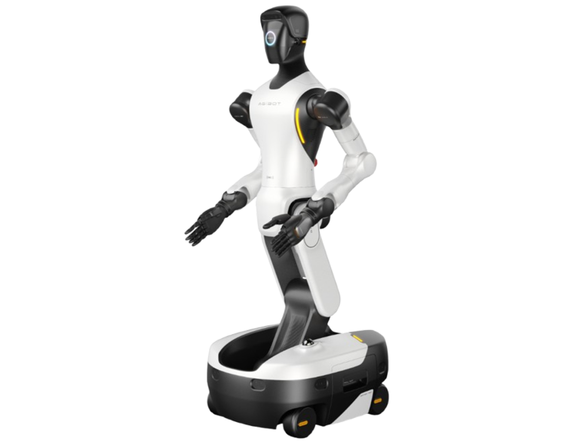 智元精灵 G2 | 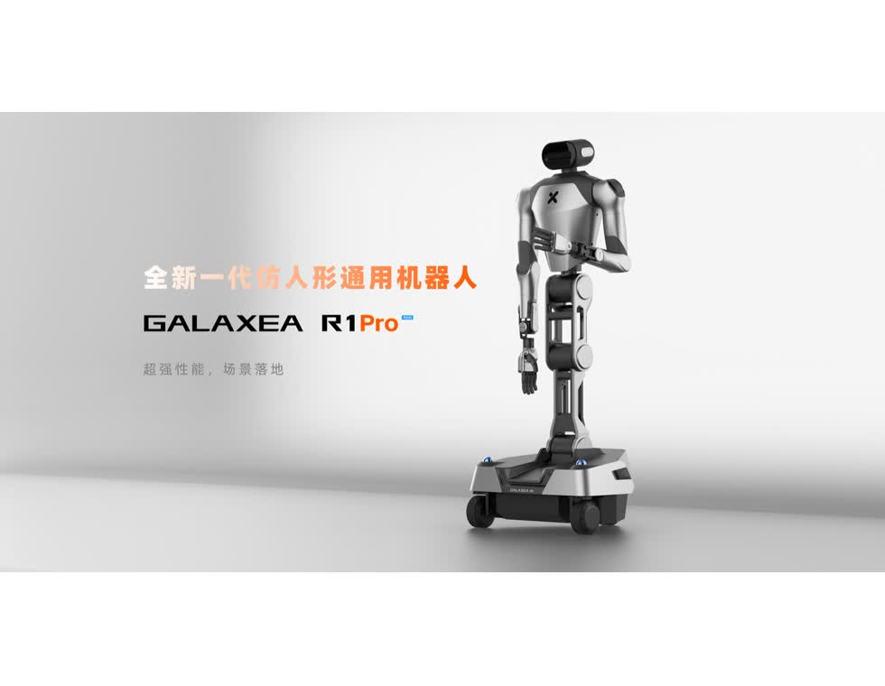 星海图 R1 Pro 2026 | 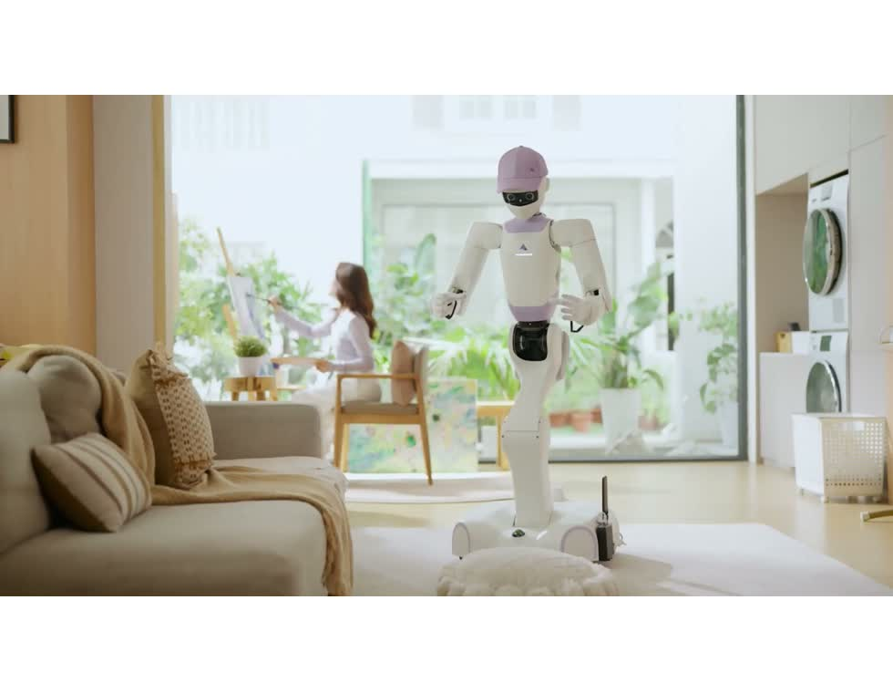 星尘 Astribot T1 |
| 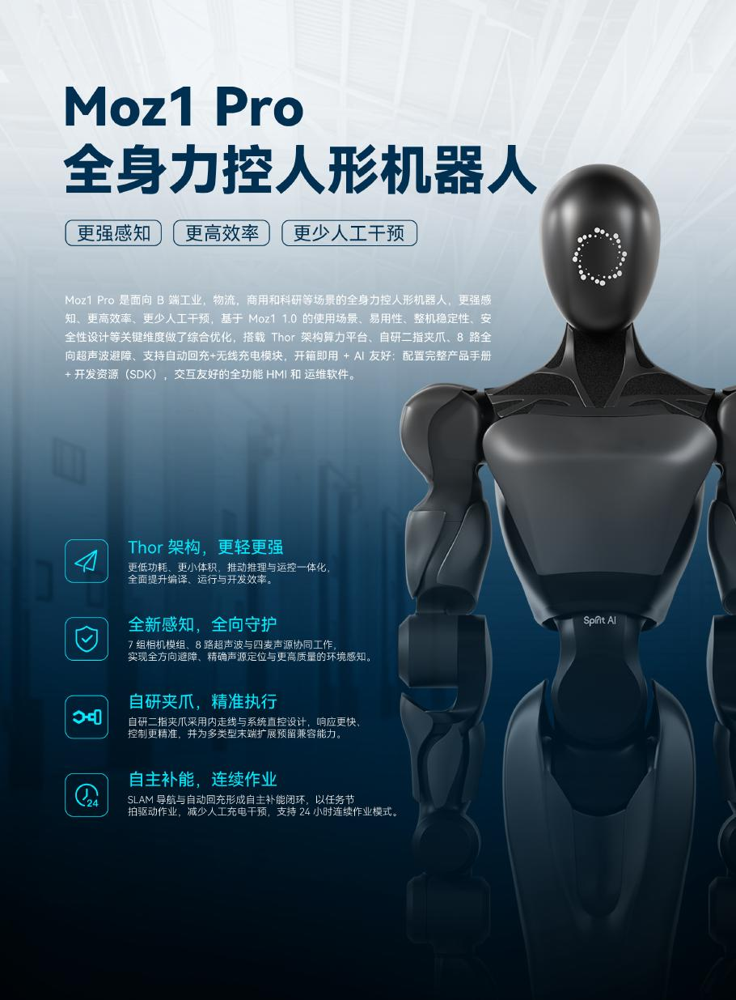 千寻智能 Moz1 Pro |  |  |
| 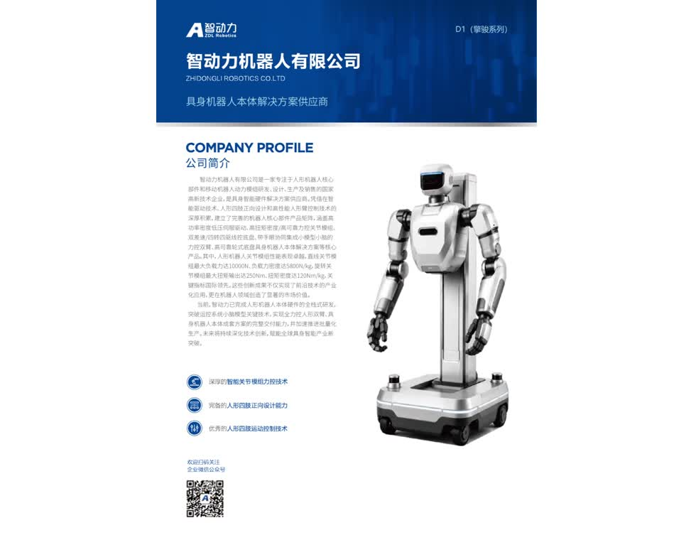 智动力 D1 | 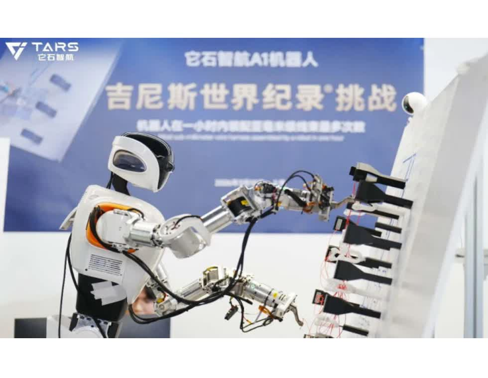 它石 TARS A1 | 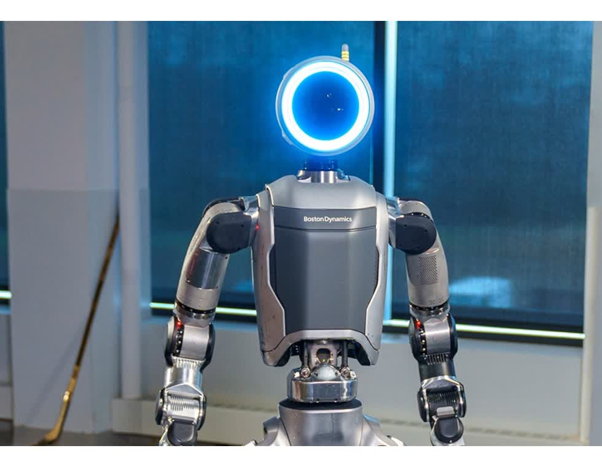 Boston Dynamics Atlas |
| 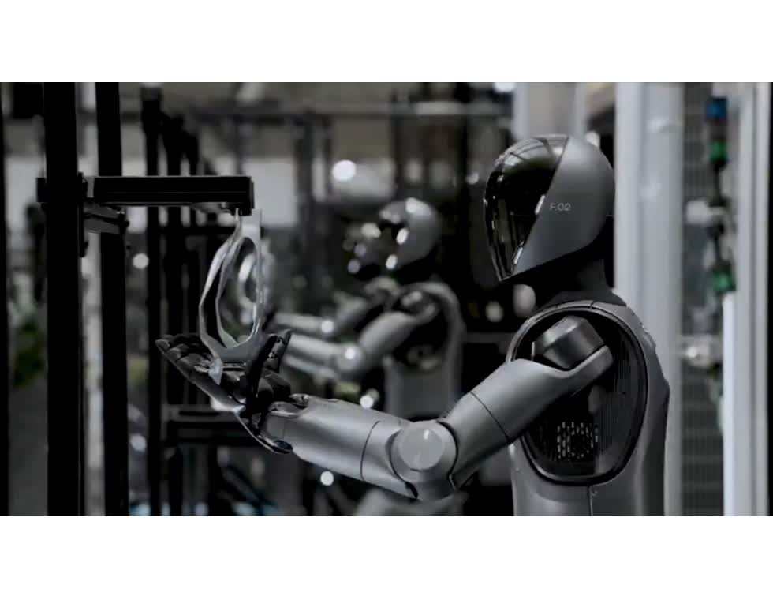 Figure 03 | 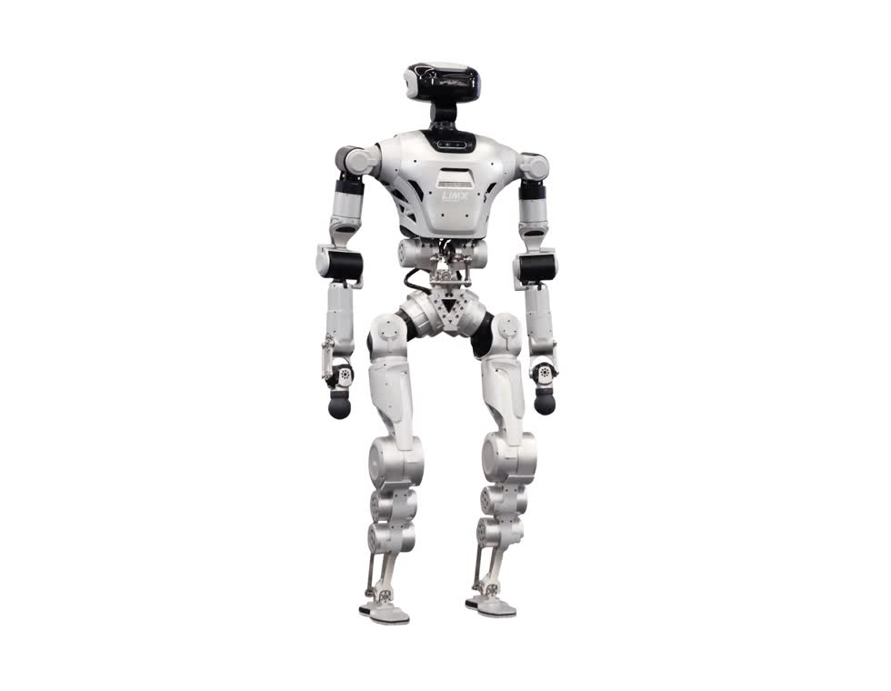 逐际动力 Oli EDU | 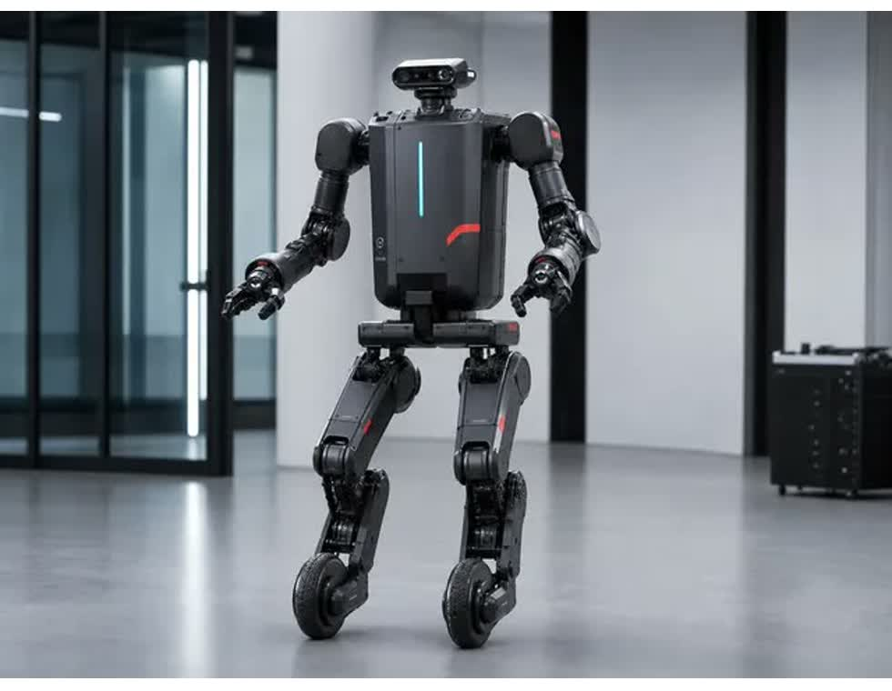 逐际动力 TRON 2 双臂形态（第三方识别图） |
| 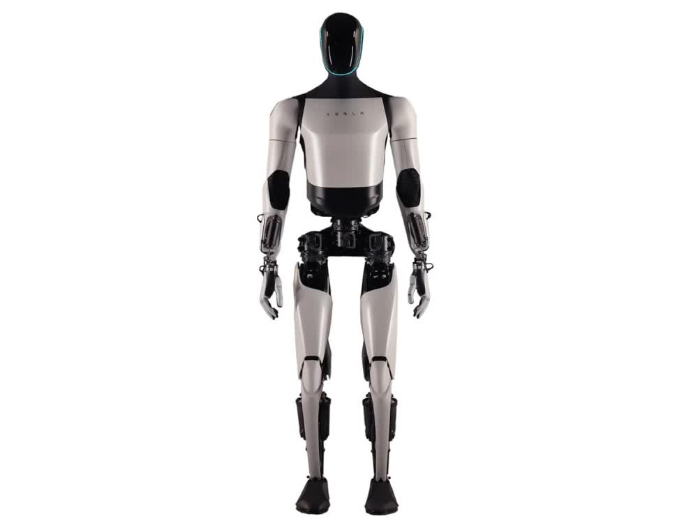 Tesla Optimus（第三方识别图） | 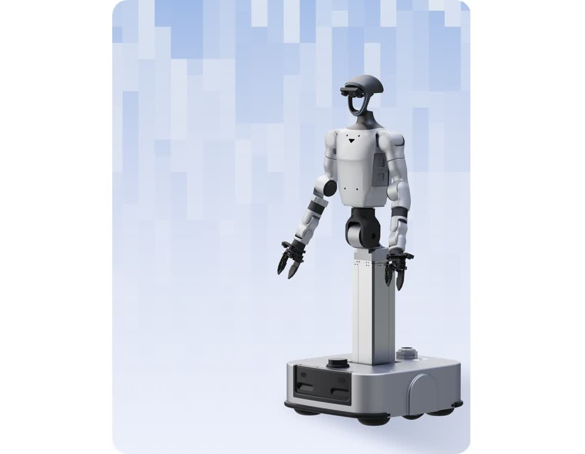 宇树 G1-D 旗舰版 | 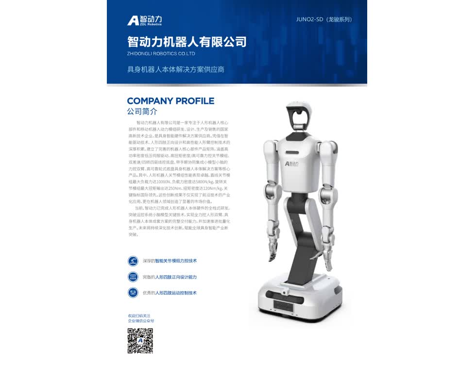 智动力 JUNO2-SD |

## 布线捋线综合排序

| 本体 | 综合分 | 横移门槛 | 产品阶段 | 决策 |
|---|---:|---|---|---|
| 智元精灵 G2 | 4.60 | 通过 | 量产/部署 | 优先 POC；验证横移停稳后的视觉与双手 TCP 误差。 |
| 星海图 R1 Pro 2026 | 4.10 | 通过 | 现货/科研与行业落地 | 条件 POC；重点处理 ±0.5 mm 精度和机械臂无制动器。 |
| 千寻智能 Moz1 Pro | 3.93 | 通过待实测 | 供应商发布/待交付验证 | 条件 POC；文档确认三自由度横移，重点验证整链路精度、外部力控接口和连续运行。 |
| Boston Dynamics Atlas | 3.85 | 双足待实测 | 早期客户导入 | 技术标杆；采购与国内集成可行性低。 |
| Figure 03 | 3.80 | 双足待实测 | 量产爬坡/客户验证 | 触觉和量产设计突出；无公开工业 SDK。 |
| 智动力 D1 | 3.80 | 通过待实测 | 供应商产品 | 条件 POC；重型平台，需验证整链路精度。 |
| 它石 TARS A1 | 3.65 | 待确认 | 产线验证/规模部署计划 | 必须专项尽调；任务证据强但本体与验收数据不透明。 |
| 逐际动力 LimX Oli EDU | 3.35 | 双足待实测 | 可购开发平台 | 适合算法研究；工业化指标不足。 |
| 星尘 Astribot T1 | 3.20 | 待确认 | 量产/发货 | 价格和柔性突出；轮系、蟹行、精度与SDK未披露，补齐资料后再决定POC。 |
| 逐际动力 TRON 2 双臂形态 | 3.20 | 待确认 | 可购开发平台 | 多形态和接口开放；“四向移动”不能直接等同纯横移。 |
| Tesla Optimus | 2.80 | 待确认 | 产线建设/内部验证 | 规格与采购接口不足，不进入正式供应商短名单。 |
| 宇树 G1-D 旗舰版 | 2.30 | 不通过 | 官方产品 | 差速底盘；更适合数采和开发。 |
| 智动力 JUNO2-SD | 2.15 | 不通过 | 供应商产品 | 差速底盘且精度、力控量化不足。 |

分数不能越过硬门槛，也不能代替供货资格。Atlas、Figure 03 即使分数较高，如果无法采购、无法开放接口或无法承担本地售后，就不能进入最终商务排名。

## 新增产品参数与风险

| 本体 | 公开关键参数 | 结构优势 | 主要缺口/风险 |
|---|---|---|---|
| Atlas | 1.9 m、90 kg、56 DoF、持续负载 30 kg、瞬时 50 kg、4 h、Reach 2.3 m、IP67 | 工业负载、全身工作空间、连续关节、自动换电、Orbit 对接 MES/WMS | 负载口径不是单臂额定值；无公开 SDK/末端接口；选择性客户导入；侧步精度未知。 |
| Figure 03 | 1.73 m、61 kg、负载 20 kg、1.2 m/s、5 h、2.3 kWh | 指尖约 3 g 压力检测、手掌相机、柔顺手、2 kW 无线充电、UN38.3、量产设计 | 负载口径和自由度不完整；Helix 封闭；无公开工业 SDK；工业横移和 TCP 精度未知。 |
| Tesla Optimus | 官方仅确认通用、自主、双足定位及产线建设 | 汽车制造、视觉 AI 与规模制造潜力 | 当前代身高、重量、负载、续航、自由度、精度、接口、认证和外售计划均缺失。 |
| LimX Oli EDU | 1.65 m、≤55 kg、31 DoF（不含末端）、单臂最大 3 kg、约 2 h、5 km/h | 上下层运动 API、传感器 API、ROS/仿真工具链、可换末端和抽屉式电池 | 无工业重复精度、IP、MTBF；双足侧步的节拍、稳定性和末端误差未知。 |
| TRON 2 双臂形态 | 单臂 7 DoF、额定 3 kg/最大 5 kg、±0.5 mm、双轮足 3–5 m/s | 双足/双轮足多形态、ROS1/2、EtherCAT、RS485、多电压接口 | 官方“四向移动”定义不清；力控量化和工业认证不足；多形态增加维护复杂度。 |
| R1 Pro 2026 | 1.7 m、126 kg、三舵轮全向、单臂 7 DoF、额定 3.5 kg/峰值 5 kg、0–2 m 工作空间、±0.5 mm | 直接满足横移；躯干升降/横摆/俯仰；头/腕视觉和 360°激光；标准电动夹爪 | A2 机械臂无制动器；±0.5 mm 难以单靠位置控制完成精密插接；腕部力传感/相机存在选配口径。 |
| Moz1 Pro | 1.50–1.85 m、26 DoF、单臂 7 DoF、5 kg、700 mm、标称 ±0.05 mm、全向轮、稳定最高 1.0 m/s | SDK 明确开放 `[vx, vy, wz]`，支持保持朝向横移；全关节力矩传感、腕部视觉、ROS 2/Python 和 120 Hz 外部控制 | 在线手册主体为旧款 Moz1；公开 SDK 仅开放位置和速度指令，未见力矩/末端力接口；重量、单次续航、Pro IP与安全认证缺失；补能和运行时长口径冲突。 |
| Astribot T1 | 1.55 m、约 66 kg、23 DoF（不含末端）、单臂 5 kg、8.99 万元起 | 绳驱柔性、碰撞卸力、可换末端与算力背包、自动回充/快捷换电；已公开量产下线 | 官网尚无完整数据表；轮式底盘未证明全向/蟹行；重复精度、力控接口、续航、SDK、IP和安全认证均未量化。 |
| TARS A1 | 公开确认轮式 A1；完成一小时 105 次亚毫米线束装配纪录 | 唯一具有强线束任务证据；具备模型、本体、夹爪和产线协同经验 | 底盘轮系、臂展、负载、续航、自由度、SDK、IP 全部缺少公开规格；公开纪录不能证明百台部署验收；工装、耗材和 MES 成本高。 |

## 三类场景适配

| 本体 | 3C/家电打包组装 | 精密件转移 | 线束布线与插接 |
|---|---|---|---|
| 智元 G2 | 高：全向底盘和双臂工作空间适合柔性工位 | 中高：力控强；需验证移动后精度 | 高：当前最均衡的标准本体候选 |
| 星海图 R1 Pro | 高：轮式全向和标准夹爪便于快速集成 | 中：±0.5 mm，需要视觉/力控闭环 | 中高：底盘合适；断电下坠与插接精度是硬风险 |
| 千寻智能 Moz1 Pro | 高：5 kg/700 mm双臂、全向底盘和ROS 2接口适合柔性工位 | 中高潜力：标称±0.05 mm，但缺测试标准和移动后TCP数据 | 中高：横移接口已确认；外部力控API、专用夹爪和连续运行仍是硬风险 |
| 星尘 T1 | 中高：5 kg 单臂、紧凑机身和柔性传动适合轻载多任务 | 中低：未公开重复定位和移动后TCP精度 | 中低：轮式但未证明全向/蟹行，不能沿用S1结论 |
| Atlas | 高：更适合重件、料箱和复杂整身搬运 | 中高：感知与全身控制强，精度未量化 | 中：能力潜力高，但线束夹爪与采购集成不明确 |
| Figure 03 | 高：感知、柔顺手和塑料袋等不规则物体操作突出 | 高潜力：触觉灵敏；工程重复精度未公开 | 中高潜力：触觉适合柔性物体，缺少线束量产验证 |
| TARS A1 | 高：已公开手机装盒等任务 | 高：有亚毫米任务纪录 | 高证据/高风险：任务最对口，但规模验收和本体透明度不足 |
| LimX Oli/TRON 2 | 中：开放平台便于二开 | 中：TRON 2 有 ±0.5 mm，Oli 未公开 | 中低：侧向移动和工业耐久性未验证 |
| Tesla Optimus | 待评估 | 待评估 | 待评估；目前无法形成工程选型结论 |

## 关于它石项目的判断

它石不能简单归类为“本体供应商横向参数领先”。其优势更接近“模型 + 专用本体 + 夹爪/工装 + 数据闭环 + 产线集成”的成套方案：

- 正面证据：天海电子公开确认联合攻坚线束制造；吉尼斯确认 A1 一小时完成 105 次亚毫米线束装配；上海经信部门披露安波福百台部署计划。
- 反向证据：内部沟通反馈当前部署尚未达到最终要求；2 m 内门板/前后保线束受臂展和工位约束；场地、工装板、接插件和端子损耗较大；夹爪设计、防滑和插拔更换是主要硬件瓶颈；后期依赖 MES 与工厂工具链人员。
- 决策含义：必须用合同验收口径而非展示纪录评估。至少取得分工序节拍、一次成功率、OEE、损伤率、人工介入率、最终验收比例和全生命周期成本，才能判断是否满足 2.5 年回本。

## 共性硬问题

1. 横移 2 m 后，底盘定位误差、视觉重定位时间和双手 TCP 误差分别是多少。
2. 对柔性线束的检测、抓取点选择、滑移检测、拉力限制和异常恢复如何闭环。
3. 夹爪是否支持防滑、快速更换、断电保持、插拔寿命和易损件成本核算。
4. 机器人起火、电池热失控、急停、STO、网络隔离、IP、防撞和机械臂断电下坠如何处理。
5. MES、工单、视觉标定、工具管理、数据回传和版本升级由谁负责，停线时如何恢复。
6. 以 2.5 年回本为目标，CAPEX 必须包含场地、工装、夹爪迭代、试错耗材、MES 集成和驻场维护，而不只是机器人售价。

## 主要公开来源

- [Boston Dynamics Atlas](https://bostondynamics.com/products/atlas/)
- [Figure 03 产品页](https://www.figure.ai/figure) 与 [技术介绍](https://www.figure.ai/news/introducing-figure-03)
- [Tesla AI & Robotics](https://www.tesla.com/AI)
- [逐际动力 Oli 参数](https://www.limxdynamics.com/zh/products/oli/spec) 与 [TRON 2 参数](https://www.limxdynamics.com/zh/products/tron2/spec)
- [星海图 R1 Pro 产品页](https://galaxea-ai.com/cn/products/R1-Pro) 与 [2026 硬件文档](https://docs.galaxea-dynamics.com/R1Pro/docs/2026/)
- [千寻智能 Moz1 在线手册](https://docs.spirit-ai.com/zh/moz1/get-started.html)、[MozRobot SDK](https://docs.spirit-ai.com/zh/sdk/get-started.html) 与供应商 Moz1 Pro 产品彩页
- [星尘智能 T1 首页](https://www.astribot.com/)、[无锡市政府量产信息](https://www.wuxi.gov.cn/doc/2026/07/11/4803940.shtml)、[深圳新闻网发布参数](https://www.sznews.com/news/content/2026-05/27/content_32067943.htm) 与 [世界机器人大会展品信息](https://wrc.cie.org.cn/expo/company/441.html)
- [天海电子与它石战略合作](https://www.thb.com.cn/content/details_17_319668.html)、[上海经信委产业化信息](https://www.sheitc.sh.gov.cn/zxxx/20260710/480d32461ca145e3bf067ce67dc6c203.html)、[吉尼斯线束纪录](https://guinnessworldrecords.com.br/world-records/782788-most-sub-millimeter-wire-harness-assembled-by-a-robot-in-one-hour)
